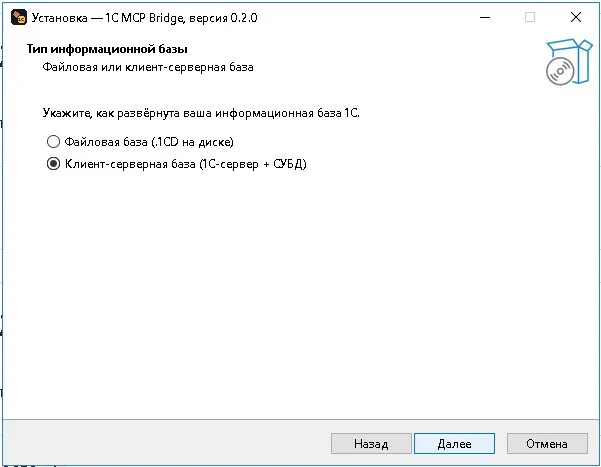
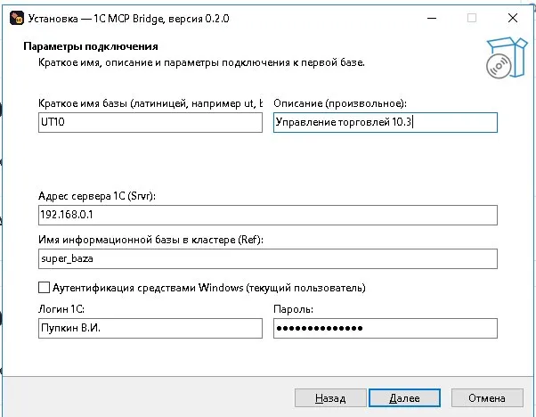
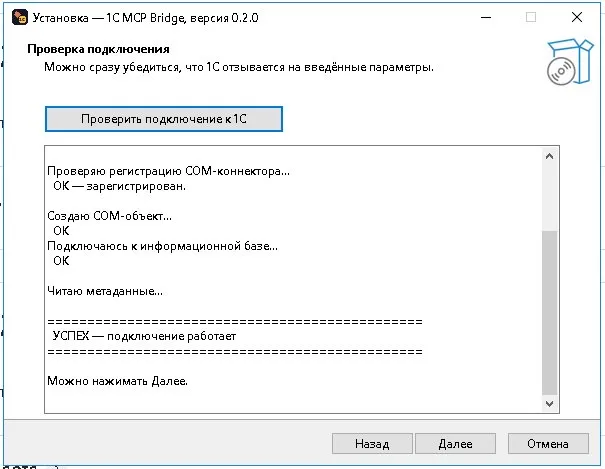
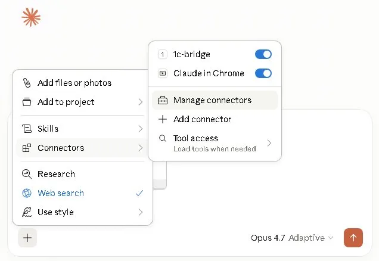
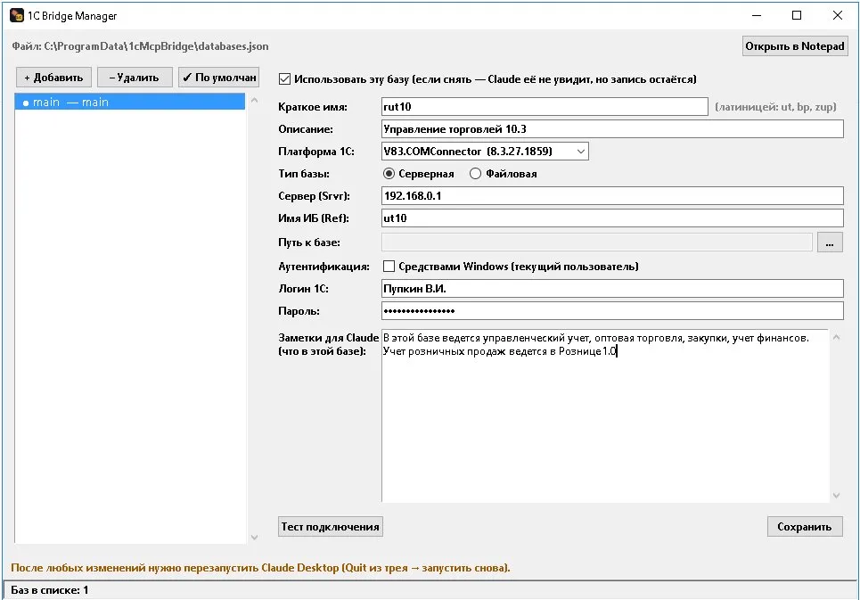

<div align="center">


# 1C MCP Bridge

**Подключите Claude Desktop к 1С:Предприятию и работайте с базой как с источником данных через диалог.**

[](../../releases/latest)
[](LICENSE)
[]()

</div>

---

## Что это

`1c-mcp-bridge` — это сервер [Model Context Protocol](https://modelcontextprotocol.io/),
который подключает Claude Desktop напрямую к одной или нескольким информационным
базам 1С через COM-коннектор. Claude получает пять инструментов
(`execute_query`, `describe_object`, `list_metadata`, `get_object_by_ref`,
`list_databases`) и работает с базой так же, как с обычным источником данных:
формулирует запрос на языке запросов 1С, исполняет, возвращает результат, считает
аналитику.

```
┌──────────────────┐   stdio    ┌──────────────────┐    COM    ┌──────────────────┐
│  Claude Desktop  │ ─────────► │ MCP-сервер (Py)  │ ────────► │ 1С:Предприятие   │
└──────────────────┘            └──────────────────┘           └──────────────────┘
```

## Кому это нужно

* **Бухгалтеру / финансовому аналитику**, который хочет сказать «покажи топ-10
  покупателей за апрель» и получить таблицу.
* **Разработчику 1С**, которому удобно проверить структуру конфигурации без
  захода в Конфигуратор.
* **Команде с несколькими базами** (УТ + БП + ЗУП) — Claude видит все настроенные
  базы сразу, для каждой можно дать осмысленное описание, и Claude сам выбирает
  правильную для конкретного вопроса.

## Что умеет

| Среда | Поддержка |
|---|---|
| Платформа 1С:Предприятие | 8.2, 8.3, 8.5 |
| Файловая база (.1CD) | да |
| Клиент-серверная база (1С-сервер) | да |
| Аутентификация Windows (OS-auth) | да |
| Аутентификация средствами 1С | да |
| Несколько баз одновременно | да |
| ОС | Windows 10 / 11 / Server 2016+ |

> **Только чтение.** В версии v0.2.0 все операции строго read-only —
> `execute_query` использует объект `Запрос`, который не модифицирует данные.
> Запись и редактирование запланированы на v0.3.0 (см. [Roadmap](#roadmap)).

## Установка

1. Скачайте `1cMcpBridge-Setup-<версия>.exe` со страницы
   [Releases](../../releases/latest).
2. Запустите от имени администратора (нужно для регистрации COM-коннектора).
3. Пройдите 5 шагов мастера:

<table>
  <tr>
    <td></td>
    <td></td>
  </tr>
  <tr>
    <td align="center"><i>Выбор типа базы — файловая или клиент-серверная</i></td>
    <td align="center"><i>Параметры подключения и краткое имя базы</i></td>
  </tr>
  <tr>
    <td colspan="2"></td>
  </tr>
  <tr>
    <td colspan="2" align="center"><i>Тест подключения прямо из мастера — можно убедиться что 1С отзывается</i></td>
  </tr>
</table>

4. После установки — перезапустите Claude Desktop (правый клик по иконке в
   трее → Quit, потом запустите заново). В новом чате должен появиться
   подключённый MCP-сервер `1c-bridge`:

<div align="center">

</div>

5. Дальше задавайте вопросы:

> Покажи топ-10 покупателей по выручке за апрель 2026 с использованием регистра
> Продажи. Сначала посмотри его структуру через describe_object.

Claude сам пройдёт по инструментам, составит и выполнит запрос, вернёт таблицу.

## Несколько баз и заметки для Claude (v0.2.0)

Если у вас несколько баз — после установки запустите **1C Bridge Manager**
из меню Пуск. Он позволяет:

* Добавить любое количество баз с разными платформами (8.2/8.3/8.5).
* Назначить базу по умолчанию (используется когда Claude не указывает явно).
* **Заметки для Claude** — большое поле, где можно описать что в этой базе
  можно найти. Эти заметки попадают в `tools/list` и Claude видит их **до**
  первого вопроса. Например: *«В этой базе ведётся управленческий учет, оптовая
  торговля, закупки, учёт финансов. Учёт розничных продаж ведётся в Розница 1.0.»*
  → Claude сам поймёт что для вопросов про розницу надо идти в другую базу.
* Переключатель «Использовать эту базу» — снимаете галку, и Claude её не видит,
  но запись остаётся (удобно для переключения тест/прод).

<div align="center">

</div>

## Безопасность

* **Только чтение.** Запись в базу не реализована. Для аналитики этого достаточно.
* **Локальное хранение.** Учётные данные базы хранятся в
  `%PROGRAMDATA%\1cMcpBridge\databases.json` и никогда не уходят за пределы
  компьютера. Anthropic видит только текст запроса и табличный результат —
  ровно то, что вы решите отправить как часть вопроса Claude.
* **Отдельный пользователь 1С.** Рекомендуется завести в 1С пользователя
  «AI-аналитик» с правами только на просмотр нужных объектов.
* **Изоляция тест/прод через переключатель `enabled`** — для опасных
  экспериментов держите рабочие базы отключёнными, включайте только тестовые.

## Сборка из исходников

Нужны: Windows, [Inno Setup 6](https://jrsoftware.org/isdl.php), Python 3.12.

```powershell
git clone https://github.com/dimax27/1c-mcp-bridge.git
cd 1c-mcp-bridge
$env:APP_VERSION = '0.2.0'
& "${env:ProgramFiles(x86)}\Inno Setup 6\ISCC.exe" installer\setup.iss
# Готовый .exe появится в .\dist\
```

Или просто нажать `Run workflow` на вкладке Actions — GitHub соберёт всё сам.

## Диагностика проблем

Если что-то не работает — запустите диагностику:

```powershell
powershell -ExecutionPolicy Bypass -File "C:\Program Files\1cMcpBridge\installer\detect_1c.ps1"
```

Покажет какие платформы 1С нашлись, зарегистрированы ли коннекторы, есть ли
Python и Claude Desktop.

Логи установки лежат в `C:\Program Files\1cMcpBridge\installer\install.log`.
Логи работы MCP-сервера видны в Claude Desktop:
`%APPDATA%\Claude\logs\mcp-server-1c-bridge.log`.

Подробнее — см. [docs/troubleshooting.md](docs/troubleshooting.md).

## Roadmap

* **v0.2.0** *(текущая)* — мульти-база, GUI Manager, заметки для Claude.
* **v0.3.0** *(в разработке)* — выполнение 1С-кода через файл-дроппер +
  внешнюю обработку, регистр сведений `ИИДействия` для аудита всех изменений,
  обязательный маркер `[Тест]` в заголовке системы, защита от записи в
  регистры/удаления.

## Лицензия

[MIT](LICENSE) © 2026 Koovykin D.
