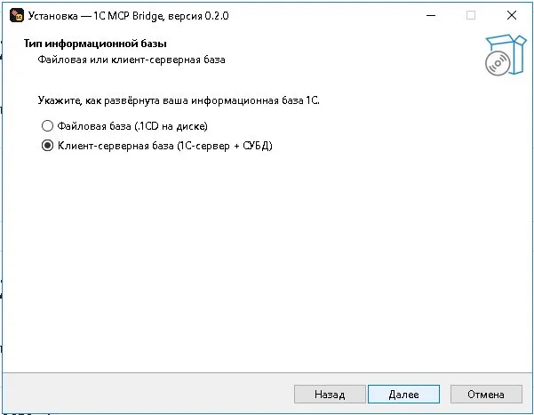
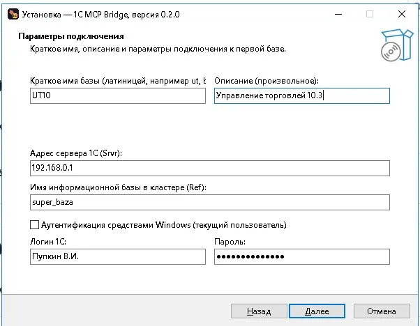
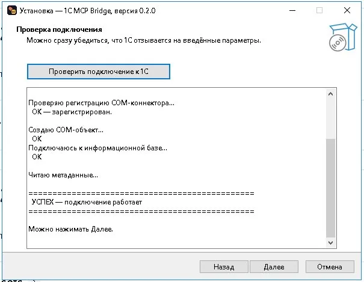
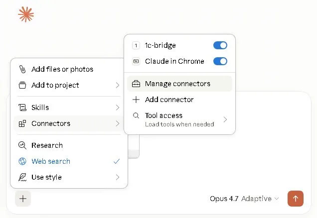
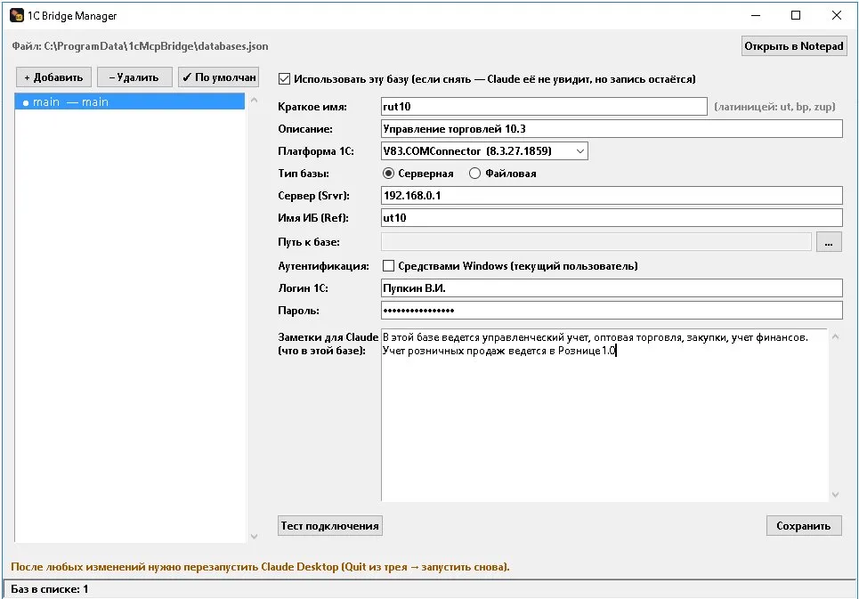

<div align="center">


# 1C MCP Bridge

**Подключите AI-ассистента (Claude, Qwen, Kimi, Reasonix, ChatGPT) к 1С:Предприятию и работайте с базой как с источником данных через диалог.**

[](../../releases/latest)
[](LICENSE)
[]()

</div>

---

## Что это

`1c-mcp-bridge` — это сервер [Model Context Protocol](https://modelcontextprotocol.io/),
который подключает AI-ассистентов (Claude Desktop, Qwen Desktop, Kimi Desktop, Reasonix, ChatGPT Desktop) напрямую
к одной или нескольким информационным базам 1С через COM-коннектор. AI-ассистент получает
пять инструментов (`execute_query`, `describe_object`, `list_metadata`, `get_object_by_ref`,
`list_databases`) и работает с базой так же, как с обычным источником данных:
формулирует запрос на языке запросов 1С, исполняет, возвращает результат, считает
аналитику.

```
┌───────────────────────┐   stdio    ┌──────────────────┐    COM    ┌──────────────────┐
│  Claude / Qwen / Kimi / Reasonix / ChatGPT │ ──────► │ MCP-сервер (Py)  │ ────────► │ 1С:Предприятие   │
└───────────────────────┘            └──────────────────┘           └──────────────────┘
```

## Кому это нужно

* **Бухгалтеру / финансовому аналитику**, который хочет сказать «покажи топ-10
  покупателей за апрель» и получить таблицу.
* **Разработчику 1С**, которому удобно проверить структуру конфигурации без
  захода в Конфигуратор.
* **Команде с несколькими базами** (УТ + БП + ЗУП) — AI-ассистент видит все настроенные
  базы сразу, для каждой можно дать осмысленное описание, и он сам выбирает
  правильную для конкретного вопроса.

## Что умеет

| Среда | Поддержка |
|---|---|
| Платформа 1С:Предприятие | 8.2, 8.3, 8.5 |
| Файловая база (.1CD) | да |
| Клиент-серверная база (1С-сервер) | да |
| Аутентификация Windows (OS-auth) | да |
| Аутентификация средствами 1С | да |
| Несколько баз одновременно | да |
| ОС | Windows 10 / 11 / Server 2016+ |

> **Только чтение.** В версии v0.2.0 все операции строго read-only —
> `execute_query` использует объект `Запрос`, который не модифицирует данные.
> Запись и редактирование запланированы на v0.3.0 (см. [Roadmap](#roadmap)).

## Установка

1. Скачайте `1cMcpBridge-Setup-<версия>.exe` со страницы
   [Releases](../../releases/latest).
2. Запустите от имени администратора (нужно для регистрации COM-коннектора).
3. Пройдите 5 шагов мастера:

<table>
  <tr>
    <td></td>
    <td></td>
  </tr>
  <tr>
    <td align="center"><i>Выбор типа базы — файловая или клиент-серверная</i></td>
    <td align="center"><i>Параметры подключения и краткое имя базы</i></td>
  </tr>
  <tr>
    <td colspan="2"></td>
  </tr>
  <tr>
    <td colspan="2" align="center"><i>Тест подключения прямо из мастера — можно убедиться что 1С отзывается</i></td>
  </tr>
</table>

4. После установки — перезапустите ваш MCP-клиент (Claude Desktop: правый клик по иконке в
   трее → Quit; Qwen/Kimi Desktop: закрыть и запустить заново). В новом чате
   должен появиться подключённый MCP-сервер `1c-bridge`:

<div align="center">

</div>

5. Дальше задавайте вопросы:

> Покажи топ-10 покупателей по выручке за апрель 2026 с использованием регистра
> Продажи. Сначала посмотри его структуру через describe_object.

AI-ассистент сам пройдёт по инструментам, составит и выполнит запрос, вернёт таблицу.

## Подключение к Qwen Desktop

Qwen Desktop разрешает только `npx`/`uvx` для stdio MCP-серверов.  
Используйте **HTTP-сервер** — он запускается без окна консоли.

1. Запустите ярлык **«1C Bridge (HTTP-сервер для Qwen)»** из меню Пуск.
   Сервер запустится в фоне (без окна). Остановить — Диспетчер задач → `python.exe`.
2. В Qwen Desktop: Настройки → MCP → Добавить:
   - Тип: **StreamableHTTP**
   - URL: `http://127.0.0.1:8000/mcp`

> Для автозапуска при входе в систему — добавьте ярлык в `shell:startup`
> или настройте Планировщик заданий Windows.
>
> Журнал работы HTTP-сервера (запуск, ошибки, запросы) пишется в
> `%PROGRAMDATA%\1cMcpBridge\http-server.log` — если сервер «молча» не
> стартует (например, занят порт 8000), ошибка будет в этом файле.

## Подключение к ChatGPT Desktop

ChatGPT Desktop (MSIX-приложение OpenAI Codex) запускает stdio MCP-серверы в
Windows-песочнице, где COM-коннектор 1С и сеть до сервера 1С недоступны, —
поэтому, как и для Qwen, используется **HTTP-сервер** моста (процесс работает
вне песочницы, под обычным пользователем).

Установщик настраивает ChatGPT автоматически (если найден `config.toml` в
`%USERPROFILE%\.codex`): в `[mcp_servers.1c-bridge]` записывается
`url = "http://127.0.0.1:8000/mcp/<токен>"` вместо `command`/`args` (stdio).

Ручная настройка:

1. Запустите ярлык **«1C Bridge (HTTP-сервер для Qwen)»** из меню Пуск
   (это тот же сервер; ярлык не переименован для совместимости).
2. В файле `%USERPROFILE%\.codex\config.toml` приведите секцию к виду:
   ```toml
   [mcp_servers.1c-bridge]
   enabled = true
   url = "http://127.0.0.1:8000/mcp/<токен>"
   ```
   Токен лежит в `%PROGRAMDATA%\1cMcpBridge\.http_token`. Старые ключи
   `command`/`args`/`env` и подсекцию `[mcp_servers.1c-bridge.env]` удалите
   (или просто переустановите мост — установщик всё поправит сам).
3. Перезапустите ChatGPT Desktop (полный выход, не просто закрытие окна) и
   откройте **новый** чат. В поле ввода наберите `/mcp` — сервер `1c-bridge`
   должен быть в списке подключённых. Затем вызывайте через `@1c-bridge …`.

> **ВАЖНО — Desktop ≠ Web.** Локальный URL `http://127.0.0.1:8000/mcp/<токен>`
> работает **только** в ChatGPT Desktop / Codex CLI / IDE-расширении, которые
> читают `~/.codex/config.toml` и запущены на этом же компьютере.
> В **веб-версии** (chatgpt.com → Плагины) MCP-серверы подключаются через
> облако OpenAI: запросы идут с их серверов, и `127.0.0.1` до вашего
> компьютера не доходит. Для веб-версии нужен удалённый endpoint
> (публичный HTTPS или Secure MCP Tunnel — см. ниже).

### ChatGPT Web и Secure MCP Tunnel

Веб-плагины ChatGPT (chatgpt.com/plugins) не могут обращаться к локальному
серверу. Варианты:

1. **Secure MCP Tunnel** (рекомендуется для доступа к базе 1С): на вашем
   компьютере запускается `tunnel-client`, который сам устанавливает
   исходящее HTTPS-соединение с OpenAI и пересылает MCP-вызовы на локальный
   `http://127.0.0.1:8000/mcp/<токен>`. Входящий порт в интернет открывать
   не нужно. В разделе Плагины при создании MCP-сервера выбирается
   **Connection → Tunnel**; потребуются `tunnel_id`, runtime API key и
   запущенный `tunnel-client`.
2. **Публичный HTTPS reverse proxy** до моста — проще, но менее безопасно
   для доступа к учётным базам; не рекомендуется.

Локальный HTTP-сервер моста всегда слушает только `127.0.0.1` — сам по себе
он в интернет не публикуется.

## Несколько баз и заметки для AI (v0.3.0)

Если у вас несколько баз — после установки запустите **1C Bridge Manager**
из меню Пуск. Он позволяет:

* Добавить любое количество баз с разными платформами (8.2/8.3/8.5).
* Назначить базу по умолчанию (используется когда AI не указывает явно).
* **Заметки для AI** — большое поле, где можно описать что в этой базе
  можно найти. Эти заметки попадают в `tools/list` и AI-ассистент видит их **до**
  первого вопроса. Например: *«В этой базе ведётся управленческий учет, оптовая
  торговля, закупки, учёт финансов. Учёт розничных продаж ведётся в Розница 1.0.»*
  → AI сам поймёт что для вопросов про розницу надо идти в другую базу.
* Переключатель «Использовать эту базу» — снимаете галку, и AI её не видит,
  но запись остаётся (удобно для переключения тест/прод).

<div align="center">

</div>

## Безопасность

* **Только чтение.** Запись в базу не реализована. Для аналитики этого достаточно.
* **Локальное хранение.** Учётные данные базы хранятся в
  `%PROGRAMDATA%\1cMcpBridge\databases.json` и никогда не уходят за пределы
  компьютера. Anthropic видит только текст запроса и табличный результат —
  ровно то, что вы решите отправить как часть вопроса AI-ассистенту.
* **Отдельный пользователь 1С.** Рекомендуется завести в 1С пользователя
  «AI-аналитик» с правами только на просмотр нужных объектов.
* **Изоляция тест/прод через переключатель `enabled`** — для опасных
  экспериментов держите рабочие базы отключёнными, включайте только тестовые.
* **Пароли 1С** хранятся в `%PROGRAMDATA%\1cMcpBridge\databases.json`. Файл защищён ACL — доступ только текущему пользователю, SYSTEM и администраторам. По возможности используйте **аутентификацию Windows** вместо логина/пароля (DPAPI запланирован на v0.5.0).
* **HTTP-сервер** (для Qwen, ChatGPT/Codex) слушает только `127.0.0.1` — доступ из сети закрыт. Без флага `--insecure-host` привязаться к внешнему интерфейсу нельзя. С v0.5.1 реальный маршрут включает случайный токен: `http://127.0.0.1:8000/mcp/<токен>` (см. `%PROGRAMDATA%\1cMcpBridge\.http_token`; токен в журнал и в VBS-файл не пишется).
* **Данные запросов** передаются выбранному AI-провайдеру. Результаты запросов и описания баз видны модели.
* **Ограничения**: длина запроса (10K символов), число колонок (200), параметров (50), строк ответа (10K).

## Сборка из исходников

Нужны: Windows, [Inno Setup 6](https://jrsoftware.org/isdl.php), Python 3.12.

```powershell
git clone https://github.com/dimax27/1c-mcp-bridge.git
cd 1c-mcp-bridge
$env:APP_VERSION = '0.5.3'
& "${env:ProgramFiles(x86)}\Inno Setup 6\ISCC.exe" installer\setup.iss
# Готовый .exe появится в .\dist\
```

Или просто нажать `Run workflow` на вкладке Actions — GitHub соберёт всё сам.

### Тесты

```powershell
python -m pip install -r requirements.txt -r requirements-dev.txt
python -m pytest tests -q
```

`tests/test_http_smoke.py` поднимает реальный HTTP-сервер и проверяет MCP-цикл
`tools/list` + `call_tool` через токен-путь (`/mcp/<token>`) и что `/mcp` без
токена отдаёт 404. Зависимости зафиксированы в `requirements.txt` (точные
версии — в `requirements-lock.txt`), чтобы будущие обновления SDK не ломали
установленную сборку.

## Диагностика проблем

Если что-то не работает — запустите диагностику:

```powershell
powershell -ExecutionPolicy Bypass -File "C:\Program Files\1cMcpBridge\installer\detect_1c.ps1"
```

Покажет какие платформы 1С нашлись, зарегистрированы ли коннекторы, есть ли
Python и MCP-клиенты.

Логи установки лежат в `C:\Program Files\1cMcpBridge\installer\install.log`.
Логи работы MCP-сервера:
  • Claude Desktop: `%APPDATA%\Claude\logs\mcp-server-1c-bridge.log`
  • Qwen Desktop:  `%APPDATA%\Qwen\logs\`
  • Kimi Desktop:  `%APPDATA%\Kimi\logs\`

Подробнее — см. [docs/troubleshooting.md](docs/troubleshooting.md).

## Roadmap

* **v0.4.3** *(текущая)* — мульти-клиент (Claude, Qwen, Kimi, Reasonix), HTTP-сервер, импорт JSON, безопасность ACL.
* **v0.5.4** *(текущая)* — bootstrap-журнал HTTP-сервера (ошибки запуска/импорта видны в `http-server.log`, ротация 5 МБ×3), VBS читает токен из файла при запуске, read-only аннотации инструментов, единая версия (`src/version.py`), HTTP smoke-тесты в CI.
* **v0.5.3** — лог-файл HTTP-сервера, пины зависимостей, раздел Desktop vs Web в README, smoke-тест.
* **v0.5.1** — исправлен установщик (докопированы модули `config/credentials/query_timeout`), поддержка ChatGPT Desktop (HTTP вне песочницы MSIX), реальный токен-путь у HTTP-сервера.
* **v0.5.0** — DPAPI-шифрование паролей, HTTP-токен, CI + тесты, lock-файл, сужение DLL-регистрации, логгирование долгих запросов.
* **v0.6.0** *(планируется)* — изоляция COM в worker-процессах, тайм-ауты, подпись установщика, английский README.

## Лицензия

[MIT](LICENSE) © 2026 Koovykin D.
